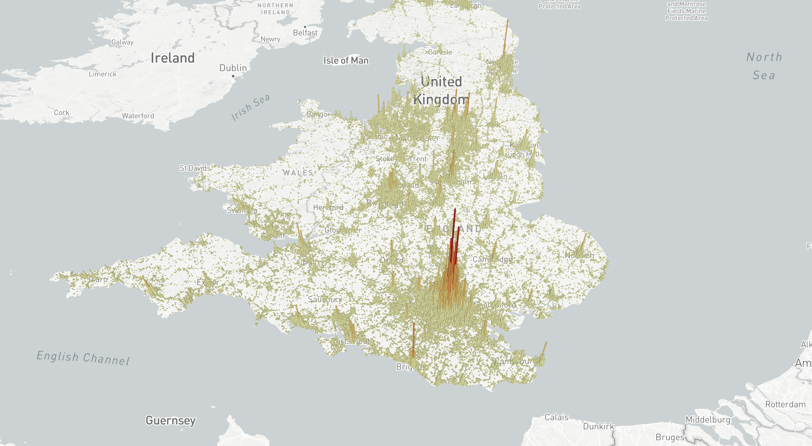

# Pydeck + SeleniumでHTMLファイルを保存する

目的：Pydeckの可視化結果を、背景透過したpngで保存し、そのプロセスを自動化する

解決策：Webブラウザを操作可能なフレームワークSelenium(主にスクレイピングで使われる)を使う

コードの概要：
1. pdk.Layerでレイヤーの作成
2. pdk.ViewStateで可視化領域の設定
3. 背景を白に設定
4. HTMLファイルに保存
5. selenium上の仮想ブラウザで、HTMLファイルを開く
6. スクリーンショットした結果を保存


# 画像




# 【作業中】環境構築とコード実行

コードはテストファイルを対象に、実行しています。

今後、可視化の要件(対象データ、可視化領域、サイズ)を設定可能な形でコード作成し、関数として定義します。

## 1. ファイルの移行

v46の中身を、本ディレクトリのv46にコピーする

```{bash}
cp -r /path/to/v46/. v46
```

## 2. Pythonバージョンの設定

バージョンは3.11.3を使っていますが、3.11以降の全てのバージョンで実行可能

## 3. ライブラリのインストール

- "geopandas>=1.0.1"
- "mapclassify>=2.8.1"
- "matplotlib>=3.10.3"
- "notebook>=7.4.2"
- "pandas>=2.2.3"
- "pydeck>=0.9.1"
- "selenium>=4.32.0"

### pipを使う場合
```{bash}
# uv pip compile pyproject.toml > requirements.txt
pip install -r requirements.txt
```

### uvを使う場合

```{bash}
uv sync
```

## 4. コードの実行

pydeck_selenium.ipynbでも、pydeck_seleniumでも同じ結果が得られる