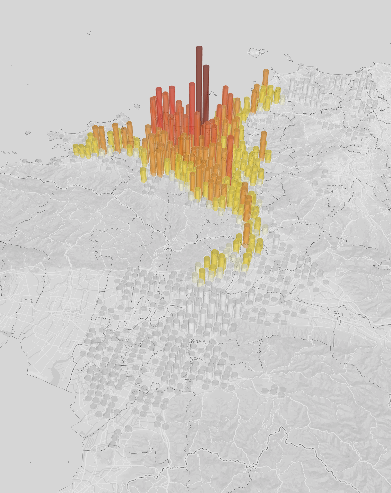

# Pydeck + SeleniumでHTMLファイルを保存する

目的：Pydeckの可視化結果を、背景透過したpngで保存し、そのプロセスを自動化する

解決策：Webブラウザを操作可能なフレームワークSelenium(主にスクレイピングで使われる)を使う

コードの概要：
1. pdk.Layerでレイヤーの作成
2. pdk.ViewStateで可視化領域の設定
3. 背景を白に設定
4. HTMLファイルに保存
5. selenium上の仮想ブラウザで、HTMLファイルを開く
6. スクリーンショットした結果を保存

# ファイルのダウンロード

都道府県・市区町村を可視化するために、境界データをdropboxからダウンロードする。

- japan_ver85：https://www.esrij.com/products/japan-shp/
- japan_cities.geojson, japan_prefectures.geojson：japan_names.py（またはjapan_names.ipynb）から出力する

https://www.dropbox.com/scl/fo/inana9ahhsqwhoy95abky/APBZEnr1Se15ISbxABDY6x0?rlkey=0059kjzrug4udl2ze1es0x5u2&st=4i9wnj7p&dl=0


# 画像

ポイント①：BaseMapの設定
- r.map_styleで設定
- 設定しない場合はNone
- 地名の表示が少なめの場合は、mapbox://styles/mapbox/light-v8
- 地名の表示が多めの場合は、mapbox://styles/mapbox/light-v10
- 自作のbasemapは地物タイルが読み込みされない、Mapboxのエラー？今後修正される？


ポイント②：地名の設定
- TextLayerで設定
- parameter={"depthTest": False}で、3Dマップ上の重なりを無視（※設定しないと他レイヤーに埋没する）
- Layersの順番を下から境界ポリゴン、地名、人口に設定（[polygon, text_layer, geojson]）

【1.BaseMap無し + 地名レイヤー有り】

ファイル名：output/fig_tenjin-density_intermediate_min-pop_100_wo_map_2120_None_bndry-and-text.png


【2.light-v8 + 地名レイヤー無し】

ファイル名：output/fig_tenjin-density_intermediate_min-pop_100_wo_map_2120_light-v8_bndry.png



【3.light-v10 + 地名レイヤー無し】

ファイル名：output/fig_tenjin-density_intermediate_min-pop_100_wo_map_2120_light-v10_bndry.png


# 【研究ディレクトリで作業する場合】環境構築とコード実行

## 1. ライブラリの追加

ライブラリの差分は[selenium](https://anaconda.org/conda-forge/selenium)のみになります。

```{bash}
conda install conda-forge::selenium
```

もしchromedriver関連でエラーが発生する場合は、お使いのPCにchromeをダウンロードするか、[参考記事](https://qiita.com/Chronos2500/items/7f56898af25523d04598)からchromedriverを設定してください。

## 2. コードのダウンロード

https://github.com/nagampere/mori_pydeck/blob/main/PlotPopByGridGivenUAbaseYearWithGivenPolygon.py から、ダウンロードしてください。

以下の画像のように、GitHubのページから「Download raw file」をクリックしてください。


# 【当ディレクトリで作業する場合】環境構築とコード実行

コードはテストファイルを対象に、実行しています。

今後、可視化の要件(対象データ、可視化領域、サイズ)を設定可能な形でコード作成し、関数として定義します。

## 1. ファイルの移行

v46の中身を、本ディレクトリのv46にコピーする

```{bash}
cp -r /path/to/v46/. v46
```

## 2. Pythonバージョンの設定

バージョンは3.11.3を使っていますが、3.11以降の全てのバージョンで実行可能

## 3. ライブラリのインストール

- "geopandas>=1.0.1"
- "mapclassify>=2.8.1"
- "matplotlib>=3.10.3"
- "notebook>=7.4.2"
- "pandas>=2.2.3"
- "pydeck>=0.9.1"
- "selenium>=4.32.0"

### pipを使う場合
```{bash}
# uv pip compile pyproject.toml > requirements.txt
pip install -r requirements.txt
```

### uvを使う場合

```{bash}
uv sync
```

## 4. コードの実行

pydeck_selenium.ipynbでも、pydeck_seleniumでも同じ結果が得られる